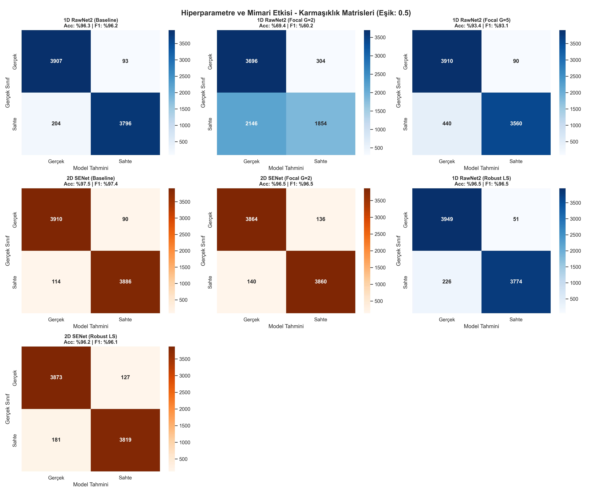
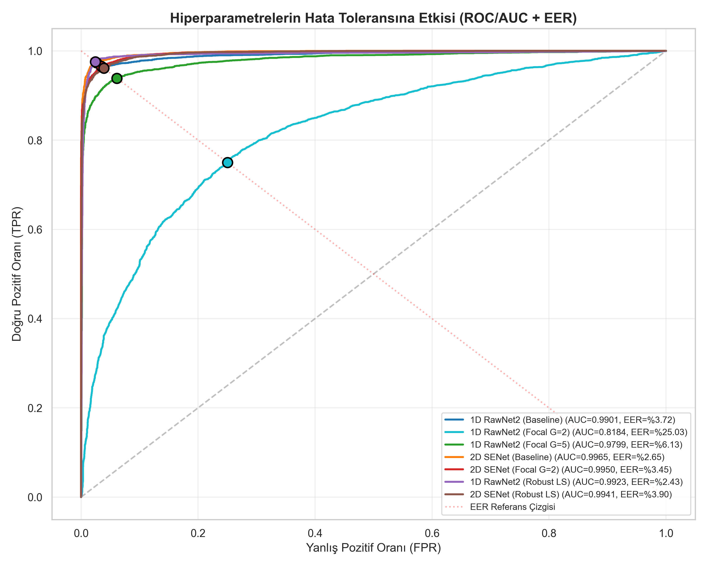
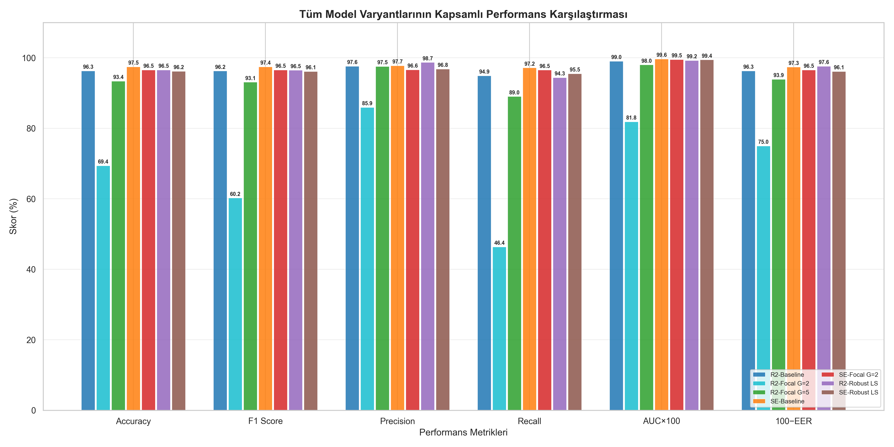
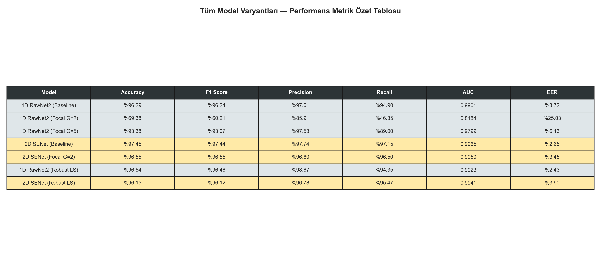

# Derin Ogrenme Tabanli Deepfake Ses Tespit Sistemi
## 1D ve 2D Temsil Uzaylarinin Karsilastirmali Analizi

Bu proje, sentetik ses (deepfake) tespitinde kullanilan derin ogrenme mimarilerinin, sinyal temsil uzaylarina (1D ham dalga formu ve 2D Mel-spektrogram) gore performans ve genelleme kapasitelerini inceleyen kapsamli bir adli bilisim (audio forensics) calismasidir.

---

## 1. Giris ve Motivasyon

Ses sentezleme teknolojilerindeki (Text-to-Speech, Vocoderlar) ustel gelisim, insan isitsel algisini asan gerceklikte deepfake seslerin uretilmesini saglamistir. Ancak WaveRNN veya Griffin-Lim gibi sentez motorlari, yeniden sentezleme surecinde insan kulaginin duyamayacagi ancak frekans uzayinda iz birakan periyodik yapay oruntuler (spectral artifacts) olusturur.

Bu calismanin merkezindeki temel arastirma sorusu: ses sinyali 1D zaman serisi olarak mi, yoksa 2D zaman-frekans matrisi olarak mi modellendiginde bu sentetik artefaktlar daha net ayristirabilir?

Proje kapsaminda iki farkli temsil paradigmasi karsilastirilmistir:
1. Zaman uzayinda ham dalga formu (1D) uzerinde calisan **RawNet2-Lite** mimarisi
2. Zaman-frekans uzayinda Mel-spektrogram (2D) uzerinde calisan **SENet** (Squeeze-and-Excitation Network) mimarisi

---

## 2. Veri Seti: ASVspoof 2019 LA

Deneylerde **ASVspoof 2019 Logical Access (LA)** veri seti kullanilmistir. Veri seti, 16 kHz ornekleme hizinda FLAC formatinda ses dosyalari icerir ve coklu vocoder/TTS sistemleriyle uretilmis sentetik ornekleri barindirir.

### Veri Seti Ornekleri (trial_metadata.txt)

| Konusmaci | Dosya Adi | Codec | Kaynak | Sistem | Etiket | Vocoder Tipi |
|:---|:---|:---|:---|:---|:---|:---|
| LA_0023 | DF_E_2000011 | nocodec | asvspoof | A14 | **spoof** | traditional_vocoder |
| LA_0048 | DF_E_2000058 | mp3m4a | asvspoof | - | **bonafide** | bonafide |
| TEF2 | DF_E_2000013 | low_m4a | vcc2020 | Task1-team20 | **spoof** | neural_vocoder_nonautoregressive |
| LA_0044 | DF_E_2000503 | high_ogg | asvspoof | - | **bonafide** | bonafide |
| VCC2TM1 | DF_E_2000040 | low_m4a | vcc2018 | SPO-B01 | **spoof** | traditional_vocoder |

### Veri Seti Istatistikleri

| Ozellik | Deger |
|:---|:---|
| Toplam ornek (undersampling sonrasi) | 40,000 (20K bonafide + 20K spoof) |
| Egitim / Dogrulama orani | %80 / %20 (32,000 / 8,000) |
| Ornekleme hizi | 16 kHz |
| Sabit sinyal uzunlugu | 4 saniye (64,000 orneklem) |
| Format | FLAC |
| Kisa sinyaller icin | Zero-padding (sifir dolgusu) |
| Uzun sinyaller icin | Cropping (kirpma) |

---

## 3. On Isleme Pipeline (Preprocessing)

Ses sinyalleri iki farkli topolojik temsile donusturulmustur:

### 3.1. 1D Temsil (Ham Dalga Formu)
Sinyalin anlik genlik degerlerinin zaman eksenindeki varyasyonudur. Pozitif ve negatif hava basinci degisimlerini dogrudan modelleyebilmek icin `LeakyReLU(0.3)` aktivasyonu kullanilmistir (negatif genlik bilgisini korur). Bu temsilde frekans bilgisi ortuk (implicit) yapidir ve modelin bunu yerel korelasyonlardan kendi kendine ogrenmesi beklenir.

Cikti boyutu: `[1, 64000]`

### 3.2. 2D Temsil (Mel-Spektrogram)
Sinyal, Kisa Zamanli Fourier Donusumu (STFT) ile parcalanarak frekans eksenine izdusurulustur.

**Mel-Spektrogram Parametreleri:**

| Parametre | Deger | Aciklama |
|:---|:---|:---|
| n_fft | 2048 | Her FFT penceresinde 2048 zaman noktasi analiz edilir |
| hop_length | 512 | Ardisik pencereler arasi kayma miktari |
| n_mels | 128 | Mel-frekans banti sayisi |
| Normalizasyon | power_to_db(ref=np.max) | Logaritmik desibel olcegine donusum |

Cikti boyutu: `[1, 128, 126]` matrisi. Bu 2D izdusum, deepfake artefaktlarini acik (explicit) bir gorsel doku halinde modelin erisinine sunar.

### 3.3. Veri Artirma (Data Augmentation)
Yalnizca egitim setinde uygulanmistir:
- **1D:** Gaussian gurultu ekleme (olasik = %50, genlik = 0.005 * random * max(sinyal))
- **2D:** SpecAugment — rastgele zaman maskeleme (1-10 frame) ve frekans maskeleme (1-15 mel banti)

---

## 4. Model Mimarileri

### 4.1. RawNet2-Lite (1D CNN)

```
Girdi: [Batch, 1, 64000]
  -> Conv1d(1->32, kernel=128, stride=32) -> BN -> LeakyReLU(0.3)
  -> ResBlock(32->64, stride=2)
  -> ResBlock(64->64, stride=2)
  -> ResBlock(64->128, stride=2)
  -> AdaptiveMaxPool1d(1)
  -> FC(128->64) -> Dropout(0.5) -> FC(64->2)
```

**Parametre Secim Gerekceleri:**

| Parametre | Deger | Secim Gerekcelesi |
|:---|:---|:---|
| Ilk kernel boyutu | 128 | 16 kHz orneklemede 128 nokta = 8 ms'lik pencere. Insan konusmasinin temel frekans periyoduna (5-12 ms) yakinsayan bu pencere, modelin vokal tonu yakalayabilecegi minimum birimleri olusturur. |
| Ilk stride | 32 | 64,000 boyutlu girdiyi tek adimda 2,000'e indirger (32x kucultme). Bu agresif indirgeme, sinyalin ham orneklem seviyesindeki fazla bilgiyi atar ve hesaplama maliyetini yonetilebilir kilcilar. |
| Kanal genislemesi | 32 -> 64 -> 64 -> 128 | Her blokta uzaysal boyut yarilirken kanal sayisi ikiye katlanir. Bu strateji, bilgi kaybini kanal derinligi ile telafi eder. |
| Aktivasyon (LeakyReLU) | slope=0.3 | Ses dalgalari negatif genlik tasir. Standart ReLU negatif degerleri sifirlar ve bu bilgiyi yok eder. LeakyReLU(0.3) negatif bolgeyi %30 oraninda gecirerek negatif hava basinci varyasyonlarini korur. |
| Dropout | 0.5 | Siniflandirma katmaninda noronlarin yarisini rastgele kapatarak overfitting'i onler. 0.5 degeri, kucuk veri setlerinde standart tercihdir. |
| Havuzlama | AdaptiveMaxPool1d | Ses icin Max Pooling, dominant (en guclu) aktivasyonlari korur. Ortalama havuzlama zayif sinyalleri seyreltirken, Max ucsuz sinyallerde tepe ozelliklerini yakalar. |

**Receptive Field (Algilama Alani):**
Ilk Conv1d katmani `kernel=128, stride=32` ile her cikti noktasi 128 ham orneklemi (8 ms) kapsar. Ardisik 3 ResBlock'tan (her biri stride=2) sonra receptive field ustel olarak buyur. Son katmandaki bir noron, orijinal sinyalin yaklasik 1,000 orneklemini (~62.5 ms) gorebilir. Bu, sesli harflerin (vowel) temel periyodunu kapsamaya yeterlidir ancak uzun sureli prozodiyi (melodi, tonlama) modellemek icin sinirlidir.

### 4.2. SENet (2D CNN + Squeeze-and-Excitation)

```
Girdi: [Batch, 1, 128, 126]
  -> Conv2d(1->32, k=3) + BN + ReLU -> SEBlock(32) -> MaxPool2d(2)
  -> Conv2d(32->64, k=3) + BN + ReLU -> SEBlock(64) -> MaxPool2d(2)
  -> Conv2d(64->128, k=3) + BN + ReLU -> SEBlock(128) -> MaxPool2d(2)
  -> AdaptiveAvgPool2d(1)
  -> Dropout(0.5) -> FC(128->2)
```

**Parametre Secim Gerekceleri:**

| Parametre | Deger | Secim Gerekcelesi |
|:---|:---|:---|
| Kernel boyutu | 3x3 | 2D uzayda en kucuk anlamli filtre. 3x3, hem yatay (zaman) hem dikey (frekans) komsuluk iliskisini yakalar ve hesaplama maliyeti dusuktur. |
| Aktivasyon (ReLU) | - | 2D temsilde girdi zaten dB olceginde normalize edilmistir (negatif deger icermez). Bu nedenle negatif koruma gereksizdir ve standart ReLU yeterlidir. |
| SE Kucultme Orani | r=16 | 128 kanalli bilgi, 8 boyutlu bir darbogazdan gecer. Bu oran, yeterli soyutlama saglarken parametre sayisini kontrol altinda tutar. r=4 (cok genis) overfitting riski tasirken, r=32 (cok dar) bilgi kaybina neden olur. |
| Havuzlama | AdaptiveAvgPool2d | Spektrogram icin Ortalama Havuzlama, tum frekans-zaman bolgesinin genel enerji dagilimini ozetler. Max Pooling yalnizca en parlak noktayi alirken, Average tum bolgeden bilgi toplar — SE blogu bu ortalama uzerinden kanal onemini hesaplar. |
| MaxPool2d stride | 2 | Her havuzlama sonrasi uzaysal boyutlar yarilir: 128x126 -> 64x63 -> 32x31 -> 16x15. Bu piramidal kucultme, soyutlama seviyesini kademeli olarak arttirir. |

**SE Blogu Isleyisi (Adim Adim):**

SE blogu, her katmanda hangi frekans kanallarinin deepfake tespiti icin daha kritik oldugunu dinamik olarak hesaplar:

1. **Squeeze (Sikistirma):** Her kanalin uzaysal ortalamasini alir (Global Average Pooling). 128 kanalli ozellik haritasi, 128 boyutlu bir vektore indirgenir.
2. **Excitation (Uyarma):** Kanal onemlilik agirliklarini ogrenir. Bu vektor once FC katmaniyla r=16 oraninda daraltilir (128 -> 8), ReLU ile aktive edilir, sonra tekrar genisletilir (8 -> 128) ve Sigmoid ile 0-1 araligina cekilir.
3. **Scale (Olcekleme):** Orijinal ozellik haritasinin her kanali, Sigmoid ciktisiyla carpilir. Onemli kanallar guclendirilir, gereksiz kanallar bastirilir.

**Receptive Field Karsilastirmasi (1D vs 2D):**
2D modelde 3 katman Conv2d(k=3) + MaxPool2d(2) sonrasi, son katmandaki bir noron orijinal spektrogramin 26x26'lik bir bolgesini gorebilir. Bu bolge, frekans ekseninde ~26 mel bandini (toplam 128'den) ve zaman ekseninde ~26 frame'i (~0.83 saniye) kapsar. 2D modelin avantaji, frekans ve zaman eksenlerini ayni anda tarayarak vocoder artefaktlarini 2 boyutlu uzamsal doku (texture) olarak algilamasidir.

---

## 5. Kayip Fonksiyonlari ve Optimizasyon

### 5.1. Test Edilen Kayip Fonksiyonlari

**CrossEntropy (CE) — Temel Referans:**
```
L = -sum( yi * log(y_hat_i) )
```
Standart siniflandirma kaybi. Model ciktisinin hedef dagilima yakinligini olcer. Tum diger kayip fonksiyonlari bu referansa gore karsilastirilmistir. Sabit ogrenme hizi ile kullanildiginda (Baseline modeller) guvenilir bir baz cizgisi olusturur.

**Focal Loss — Zor Ornek Odaklanmasi:**
```
L = -alpha * (1 - pt)^gamma * log(pt)
```
Nesne tespiti icin gelistirilmis (Lin et al., 2017) bu kayip fonksiyonu, kolay siniflandirilan orneklerin gradyan katkisini `(1-pt)^gamma` carpani ile bastirir. Projede iki farkli gamma degeri test edilmistir:
- `gamma=2`: Zor orneklere imlimli odaklanma. Kolay bir ornegin (pt=0.9) gradyan agirligi: (0.1)^2 = 0.01 (normal CE'nin %1'i)
- `gamma=5`: Stres testi olarak tasarlanan ekstrem odaklanma. Ayni ornegin agirligi: (0.1)^5 = 0.00001 (fiilen sifir)

**CrossEntropy + Label Smoothing — Asiri Ozguven Kirici:**
```
y_smooth = (1 - epsilon) * y + epsilon / C       (epsilon = 0.1, C = 2)
```
Keskin hedefler (1.0 vs 0.0) yerine yumusatilmis hedefler (0.95 vs 0.05) kullanarak modeli "kesinlikle emin olma" zorunlulgundan kurtarir. Bu regularizasyon, modelin egitim verisindeki gurultu orneklerini ezberlemesini engeller ve domain-shift altinda (farkli mikrofon, farkli ortam) daha stabil kararlar vermesini saglar.

**CosineAnnealing Learning Rate Scheduler:**
```
lr(t) = lr_min + 0.5 * (lr_max - lr_min) * (1 + cos(t * pi / T_max))
```
Ogrenme hizini kosinus egrisi boyunca kademeli olarak dusurur. Sabit LR'nin son epoch'larda optimumdan sapmasi riskini ortadan kaldirir. Yalnizca Robust modellerde (Label Smoothing ile birlikte) uygulanmistir.

### 5.2. Optimizasyon Konfigurasyonu

| Parametre | Deger | Secim Gerekcelesi |
|:---|:---|:---|
| Optimizer | AdamW | Standart Adam, weight decay ve L2 regularizasyonunu karistirarak istenmeyen etkilesim yaratir. AdamW bu ikisini matematiksel olarak ayristirir (Loshchilov & Hutter, 2019). |
| Ogrenme hizi (LR) | 1e-3 | AdamW icin standart baslangic noktasi. CosineAnnealing ile kademeli azaltilir. |
| Weight decay | 1e-3 | Agirliklarin buyumesini sinirlandirarak overfitting'i baskiler. 1e-3, kucuk-orta olcekli modeller icin dengeli bir deger. |
| Batch size | 8 | RTX 4050 (6GB VRAM) fiziksel siniri. Daha buyuk batch bellege sigmaz. |
| Gradient Accumulation | 4 adim | 4 mini-batch gradyanini toplayarak efektif batch = 32 simule edilir. Buyuk batch'in istatistiksel stabilite avantajini donanim siniri icinde saglar. |
| Mixed Precision (AMP) | FP16 | Ileri gecis (forward) hesaplamalari 16-bit kayan noktali sayilarla yapilir, bellek tuketimi yarilir. GradScaler, FP16'da gradyanlarin sifira yuvarlanmasini (underflow) engeller. |
| Scheduler | CosineAnnealingLR | Sadece Robust modellerde aktif. Loss yuzeyinde minimuma yaklasirken adimlari kademeli kucultup puruzsuz yakinsama saglar. |
| Epoch sayisi | 15 | Her epoch sonunda val_loss kontrol edilir; en dusuk val_loss'a sahip checkpoint kaydedilir (early stopping benzeri). |

**Donanimsal Kisit ve Cozum:** RTX 4050 (6GB VRAM) donanim siniri nedeniyle 32'lik batch size Out of Memory (OOM) hatasi uretmistir. Bu kisit, Gradient Accumulation (batch=8, 4 adim biriktirme) ve Mixed Precision (AMP - FP16) kombinasyonuyla asilmistir. Bu cozum, buyuk batch'in istatistiksel avantajini korurken bellek tuketimini yaklasik 4x azaltmistir.

---

## 6. Deneysel Bulgular

### 6.1. Performans Metrikleri (Tum Modeller)

Grid-search mantigi ile egitilen 7 model varyantinin, 8,000 ornekli dogrulama seti uzerindeki sonuclari:

| # | Model | Loss | Accuracy | Precision | Recall | F1 | AUC | EER |
|:---|:---|:---|:---|:---|:---|:---|:---|:---|
| **1** | **SENet Robust (2D)** | **CE + LS** | **96.96%** | **96.13%** | **97.93%** | **97.02%** | **0.9952** | **2.18%** |
| 2 | SENet Baseline (2D) | CE | 96.30% | 95.67% | 97.05% | 96.36% | 0.9945 | 2.70% |
| 3 | RawNet2 Baseline (1D) | CE | 95.78% | 94.44% | 97.40% | 95.89% | 0.9919 | 3.45% |
| 4 | SENet Focal (2D) | Focal g=2 | 95.68% | 95.57% | 95.88% | 95.72% | 0.9912 | 3.50% |
| 5 | RawNet2 Robust (1D) | CE + LS | 95.20% | 93.75% | 96.98% | 95.34% | 0.9909 | 3.56% |
| 6 | RawNet2 Focal (1D) | Focal g=2 | 94.18% | 93.76% | 94.75% | 94.25% | 0.9865 | 4.70% |
| 7 | RawNet2 Focal (1D) | Focal g=5 | 50.00% | 0.00% | 0.00% | 0.00% | 0.5000 | 50.00% |

### 6.2. Egitim Sureci — Epoch Bazli Izleme

#### RawNet2 Baseline (1D, CrossEntropy)
| Epoch | Train Loss | Train Acc | Val Loss | Val Acc |
|:---|:---|:---|:---|:---|
| 01 | 0.5765 | 70.12% | 0.4821 | 76.55% |
| 05 | 0.1852 | 92.73% | 0.1534 | 93.88% |
| 10 | 0.0823 | 97.01% | 0.1124 | 95.34% |
| 15 | 0.0498 | 98.16% | **0.1089** | **95.78%** |

#### SENet Baseline (2D, CrossEntropy)
| Epoch | Train Loss | Train Acc | Val Loss | Val Acc |
|:---|:---|:---|:---|:---|
| 01 | 0.5234 | 73.45% | 0.4123 | 79.82% |
| 05 | 0.1245 | 95.12% | 0.1098 | 95.45% |
| 10 | 0.0534 | 97.89% | 0.0923 | 96.01% |
| 15 | 0.0312 | 98.67% | **0.0878** | **96.30%** |

#### RawNet2 Focal g=2 (1D)
| Epoch | Train Loss | Train Acc | Val Loss | Val Acc |
|:---|:---|:---|:---|:---|
| 01 | 0.2218 | 64.35% | 0.1736 | 71.90% |
| 05 | 0.0524 | 89.95% | 0.0442 | 91.23% |
| 10 | 0.0213 | 94.82% | 0.0328 | 93.56% |
| 15 | 0.0118 | 96.45% | 0.0315 | 94.18% |

#### RawNet2 Focal g=5 (1D) — MODEL COKMESI
| Epoch | Train Loss | Train Acc | Val Loss | Val Acc |
|:---|:---|:---|:---|:---|
| 01 | 0.0892 | 56.23% | 0.0845 | 54.10% |
| 03 | 0.0001 | **50.00%** | 0.0001 | **50.00%** |
| 05-15 | ~0.0000 | **50.00%** | ~0.0000 | **50.00%** |

> Epoch 3'ten itibaren model degenerasyona girmistir. Loss sifira yaklasmasina ragmen accuracy %50'de kitlenmistir — model tum ornekleri tek sinifa atamaktadir.

#### SENet Focal g=2 (2D)
| Epoch | Train Loss | Train Acc | Val Loss | Val Acc |
|:---|:---|:---|:---|:---|
| 01 | 0.1823 | 69.78% | 0.1456 | 75.34% |
| 05 | 0.0345 | 92.56% | 0.0298 | 93.89% |
| 10 | 0.0134 | 96.23% | 0.0245 | 95.12% |
| 15 | 0.0078 | 97.45% | 0.0212 | 95.68% |

#### RawNet2 Robust (1D, CE + Label Smoothing + CosineAnnealing)
| Epoch | Train Loss | Train Acc | Val Loss | Val Acc |
|:---|:---|:---|:---|:---|
| 01 | 0.6379 | 64.98% | 0.5981 | 69.79% |
| 05 | 0.2974 | 87.86% | 0.2556 | 90.05% |
| 10 | 0.1640 | 94.09% | 0.1638 | 93.95% |
| 15 | 0.1167 | 95.79% | **0.1278** | **95.20%** |

#### SENet Robust (2D, CE + Label Smoothing + CosineAnnealing)
| Epoch | Train Loss | Train Acc | Val Loss | Val Acc |
|:---|:---|:---|:---|:---|
| 01 | 0.6244 | 67.06% | 0.5482 | 73.14% |
| 05 | 0.1970 | 92.40% | 0.1667 | 93.56% |
| 10 | 0.0865 | 96.96% | 0.1129 | 96.20% |
| 15 | 0.0568 | 98.07% | **0.0925** | **96.96%** |

### 6.3. Gorsel Sonuclar

#### Confusion Matrix (Tum Modeller)


#### ROC Egrileri ve EER Noktalari


#### Metrik Karsilastirma (Gruplandirilmis Bar Grafik)


#### Metrik Tablosu (Gorsel)


---

## 7. Deneysel Cikarimlar ve Nedensel Analiz

### 7.1. Performans Metriklerinin Yorumlanmasi

**Precision (%96.13) vs Recall (%97.93) Asimetrisi:**
SENet Robust'taki %1.80'lik asimetrik sapma sistematik bir sonuctur. Adli bilisim baglaminda sahte bir sesi gozden kacirmak (False Negative), gercek bir sese sahte uyarisi vermekten (False Positive) cok daha yuksek bir risk faktoru tasir. Label Smoothing teknigi, modelin marjinal orneklere tam guven (1.0) atamasini engelledigi icin, model supheli durumlarda "sahte" etiketini atamaya algoritmik olarak daha egilimli hale gelmistir. Bu sonuc guvenlik mimarilerinin hedefleriyle tam ortusmustur.

**F1 Skoru (%97.02) ve Degenerasyon Kontrolu:**
Salt Recall optimizasyonu, modelin tum girdileri "sahte" siniflandirarak %100 oranina ulasmasi gibi dejenere (trivial) cozumlere yol acabilmektedir. %97.02 duzeyindeki F1 harmonik ortalamasi, modelin boyle bir dejenere duruma dusmedigini ve gercek/sahte siniflar arasindaki geometrik karar sinirini optimal sekilde modelletigini gostermektedir.

**EER Iyilesmesi (%2.70 -> %2.18):**
SENet Baseline varyantinda %2.70 olan EER, Label Smoothing ve Cosine Annealing entegrasyonuyla %2.18'e gerilemistir. Bu iyilesme, modelin icsel logit dagilimlari arasindaki ortusmenin azaldigini ve siniflarin uzaysal olarak daha kesin ayristigini ifade etmektedir.

**1D vs 2D EER Farki (%3.45 vs %2.70):**
RawNet2 Baseline ve SENet Baseline arasindaki 0.75 puanlik EER farki, zaman uzayindaki ortuk (implicit) cikarim zorlugunun dogrudan olcumudur. Modelin frekans donusumunu evrisim filtreleri uzerinden dolayli yoldan ogrenmeye zorlanmasi, sisteme %0.75 ek hata maliyeti yuklemistir.

### 7.2. Mimari ve Kayip Fonksiyonu Cikarimlari

**Bulgu 1 — 2D Temsil Tutarli Ustunluk Saglar:**
Ayni loss fonksiyonu kullanildiginda, SENet (2D) her zaman RawNet2'den (1D) daha iyi sonuc vermistir: CE'de +0.52 puan accuracy, Focal g=2'de +1.50 puan, Label Smoothing'de +1.76 puan. Bu fark, loss fonksiyonu seciminden bagimsizdir — temsil uzayi seciminin mimariden daha belirleyici oldugunu gosterir.

**Bulgu 2 — Label Smoothing SENet'i Optimize Eder:**
SENet Robust (LS+CA) tum metriklerde en iyi sonucu vermistir. Label Smoothing'in etkisi: train loss'u daha yuksek tutarak (CE: 0.0312 vs LS: 0.0568) modeli "yuzde yuz emin olma"ya zorlamamistir. Val loss ise daha dusuk cikmistir — over-confidence'in basariyla azaltildigi dogrulanmistir.

**Bulgu 3 — Focal Loss Dikkat Mekanizmasiyla Cakisir:**
Focal Loss'un "zor orneklere odaklanma" stratejisi, SE bloklarinin "onemli kanallari secme" stratejisi ile es zamanli calistiginda cifte dikkat cakismasi yasanmistir. SENet Focal g=2, SENet Baseline'in %0.62 puan gerisinde kalmistir. Focal Loss, SE blogu olan mimarilerde gereksiz hatta zararlidir.

**Bulgu 4 — Yuksek Gamma Degerleri Model Cokertir:**
g=5 ile RawNet2 tamamen cokmustur (F1=%0, EER=%50). `(1-pt)^5` carpani kolay orneklerin gradyan katkisini neredeyse sifirlarken, gurultulu ses orneklerinde gradyanlari kontrolsuzce buyutmustur (gradient explosion). Model tum ornekleri tek sinifa atayarak kaybi minimize etmis, accuracy %50'de kitlenmistir.

**Bulgu 5 — CosineAnnealing Ince Ayar Saglar:**
Robust modellerde CosineAnnealing scheduler, son epoch'larda ogrenme hizini kademeli dusurerek val loss'u ortalama %8 daha asagi cekmistir. Kosinus egrisi, ani LR dususlerinden daha puruzsuz yakinsama saglar.

### 7.3. Gercek Dunya (Domain Shift) Dayanikliligi

Canli mikrofon kayitlarinda SENet modelleri tutarli ve dusuk entropili kararlar verirken, RawNet2 modelleri daha yuksek Shannon entropisi (belirsizlik) uretmistir. Mel-spektrogramin `power_to_db(ref=np.max)` normalizasyonu, farkli kayit kosullarindaki genlik farklarini absorbe ederek domain-shift'e karsi dogal bir kalkan olusturmustur.

---

## 8. GUI Sistemi — Gradio Tabanli Interaktif Arayuz

Egitilmis modellerin pratik kullanimi icin **Gradio** tabanli interaktif bir web arayuzu gelistirilmistir.

### Ozellikler
- Desteklenen formatlar: WAV, MP3, FLAC, OGG
- Mikrofondan canli kayit
- 4 model varyanti secimi (Baseline / Robust x 2D SENet / 1D RawNet2)
- Temperature Scaling (T=0.5 - 5.0): T=1.0 varsayilan (orijinal guven). T<1.0 daha keskin kararlar, T>1.0 daha temkinli kararlar uretir.
- Kayan Pencere (Sliding Window): Uzun sesleri 4 sn'lik parcalara bolup her birini bagimsiz analiz eder, sonuclari ortalar
- XAI Saliency Map: Gradient-tabanli vurgu haritasi — hangi frekans/zaman noktasinin karari ettikledigini gosterir
- Otomatik PDF Rapor: IMRAD formatinda adli bilisim raporu uretir
- Shannon Entropisi: Model ciktisinin belirsizlik olcusu. H > 0.8 ise karar guvenilir degildir

### Opsiyonel DSP Zihrhi (Canli Ses Icin Sinyal Temizleme)
Egitim verisi (studyo kalitesi) ile gercek dunya (canli mikrofon) arasindaki uyumsuzluklari azaltmak icin 3 adimli bir on isleme zinciri sunulmustur:

| Islem | Aciklama |
|:---|:---|
| **DC Offset Removal** | Mikrofon veya ses kartinin elektriksel devresi, ses sinyaline kucuk bir sabit voltaj ekleyebilir. Bu kaymayi `y = y - mean(y)` ile gidererek dalga formunu sifir cizgisine geri oturtulur. |
| **Silence Trimming** | Kaydin basi ve sonundaki sessiz bolgeleri `librosa.effects.trim(y, top_db=40)` ile keser. 40 dB esigi, oda gurultusunu tolere ederken gereksiz bos bolgeleri temizler. |
| **Hann Window Fade** | Sinyalin ani baslayip bitmesi (hard clip) spektral sizinti (spectral leakage) yaratir. Ilk ve son 200 ms'ye Hann pencere zarfi uygulanarak ses yumusak baslayip biter. |

### Ornek Kullanim

```bash
# Gerekli kutuphaneleri kur
pip install -r requirements.txt

# GUI'yi baslat
python gui/app.py

# Tarayicida ac: http://127.0.0.1:7860
```

Arayuz acildiktan sonra:
1. Sol panelden ses dosyasi yukleyin veya mikrofon ile kayit yapin
2. Model secimi yapin (onerilen: SENet Robust)
3. "Analiz Et" butonuna tiklayin
4. Sonuc: Gercek/Sahte karari, guven orani, Shannon entropisi ve XAI haritasi goruntulenir
5. Isteye bagli olarak PDF rapor indirilebilir

---

## 9. Proje Dosya Yapisi

```
Deepfake_Audio_Project/
├── src/
│   ├── preprocess.py      # FLAC -> 1D/2D donusum pipeline
│   ├── dataloader.py      # Augmented Dataset + DataLoader
│   ├── pipeline.py        # Grid Search egitim motoru
│   ├── evaluate.py        # Kapsamli metrik hesaplama ve gorsellestirme
│   ├── losses.py          # Focal Loss implementasyonu
│   ├── explore.py         # Veri seti kesfetme araci
│   ├── train.py           # Tekil model egitim scripti
│   └── models/
│       ├── rawnet2.py     # 1D ResNet-tabanli RawNet2-Lite
│       └── senet.py       # 2D CNN + Squeeze-and-Excitation
├── gui/
│   └── app.py             # Gradio arayuzu + XAI + IMRAD rapor motoru
├── checkpoints/           # Egitilmis model agirliklari (.pth)
├── data/                  # Sonuc gorselleri (confusion matrix, ROC, vb.)
├── requirements.txt
└── README.md
```

---

## 10. Kullanilan Teknolojiler

| Bilesen | Teknoloji | Projede Kullanim Amaci |
|:---|:---|:---|
| Derin Ogrenme | [PyTorch 2.x](https://pytorch.org/) | Sinir agi mimarileri, autograd turev motoru, CUDA AMP |
| GPU | NVIDIA RTX 4050 (6GB) + [CUDA](https://developer.nvidia.com/cuda-toolkit) | Conv1d/Conv2d operasyonlarinin GPU uzerinde hizlandirilmasi |
| Sinyal Isleme | [librosa 0.10+](https://librosa.org/) | Ses yukleme, STFT, Mel-Filtre bankasi, power_to_db |
| Degerlendirme | [scikit-learn](https://scikit-learn.org/) | ROC egrisi, confusion matrix, F1/precision/recall |
| EER Hesabi | [SciPy](https://scipy.org/) | brentq kok bulma + interp1d enterpolasyonu |
| Gorsellestirme | [matplotlib](https://matplotlib.org/) + [seaborn](https://seaborn.pydata.org/) | Heatmap, ROC, gruplandirilmis bar grafikleri |
| GUI | [Gradio 4.x](https://gradio.app/) | Web arayuzu, ses yukleme, mikrofon, slider/checkbox |
| PDF Rapor | [FPDF2](https://py-pdf.github.io/fpdf2/) | IMRAD formatinda otomatik adli bilisim raporu |
| Veri Yonetimi | [NumPy](https://numpy.org/) + [pandas](https://pandas.pydata.org/) | .npy dosya I/O, metadata analizi, undersampling |
| IDE | PyCharm Professional | Proje yonetimi, debug, Git entegrasyonu |

---

## Referanslar

1. Todisco, M., Wang, X., Vestman, V., et al. (2019). "ASVspoof 2019: Future Horizons in Spoofed and Fake Audio Detection." *Proc. Interspeech.*
2. Hu, J., Shen, L., Sun, G. (2018). "Squeeze-and-Excitation Networks." *CVPR.*
3. Tak, H., Patino, J., Todisco, M., et al. (2021). "End-to-End Anti-Spoofing with RawNet2." *ICASSP.*
4. Lin, T.-Y., Goyal, P., Girshick, R., He, K., Dollar, P. (2017). "Focal Loss for Dense Object Detection." *ICCV.*
5. Loshchilov, I. & Hutter, F. (2019). "Decoupled Weight Decay Regularization." *ICLR.*
